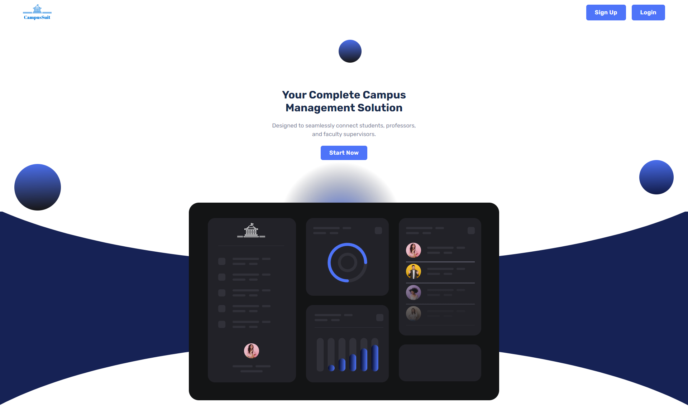
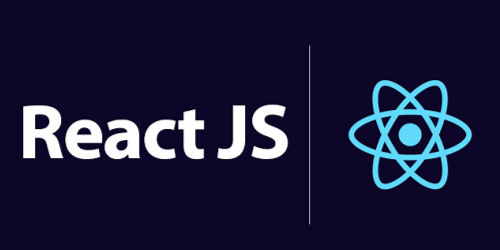
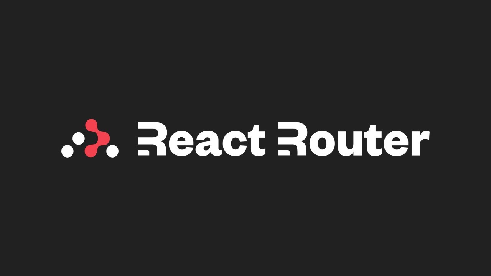
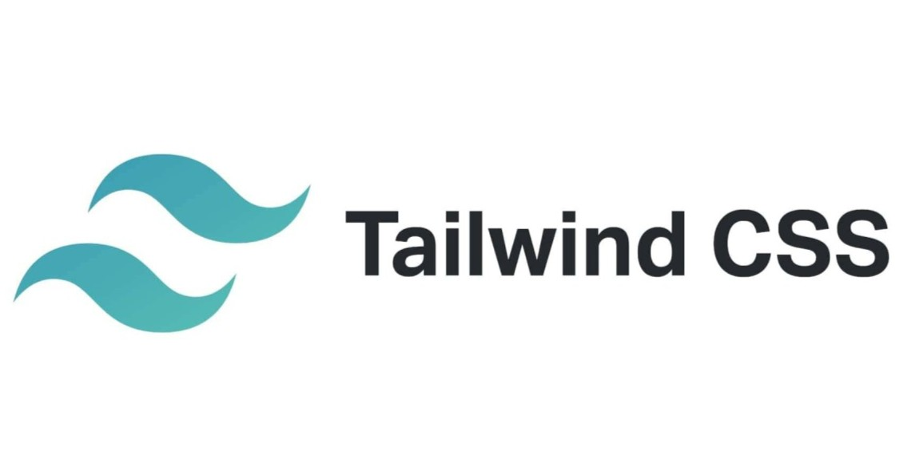
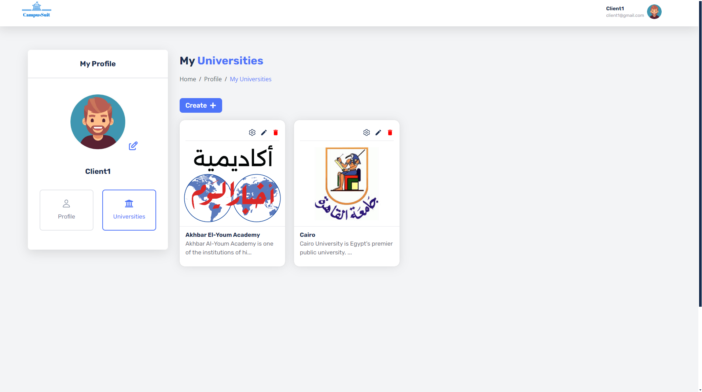
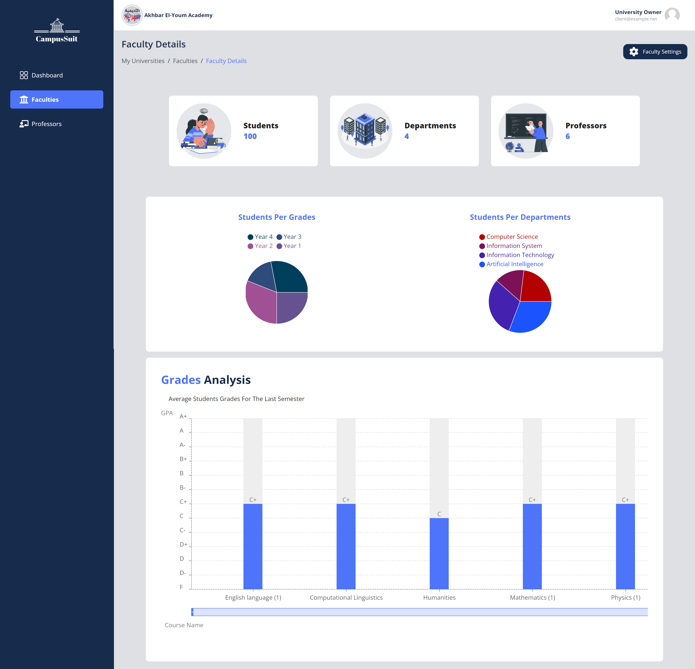
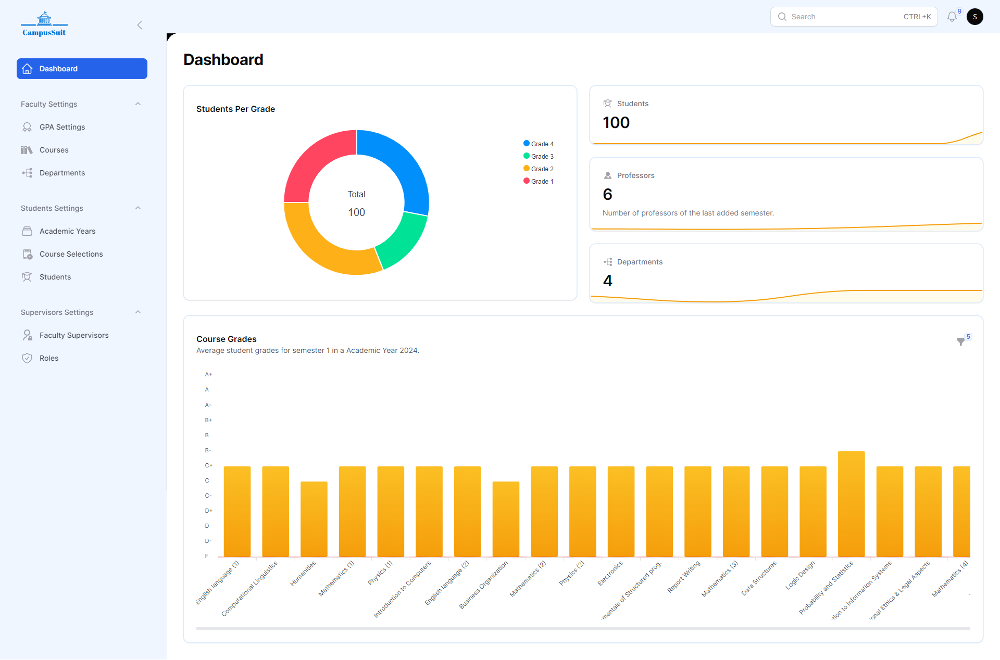
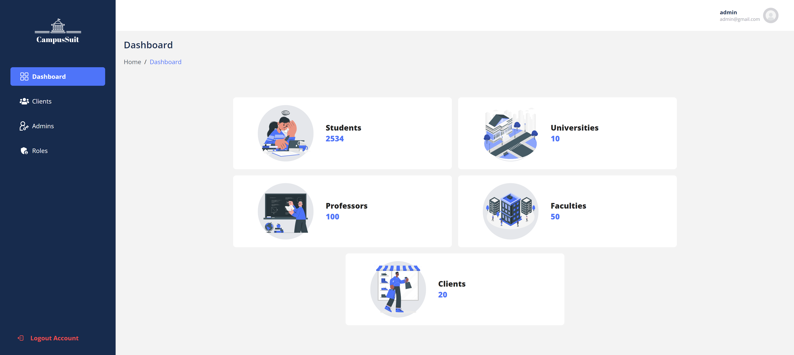

<h2 align="left">Graduation Project</h2>
<!-- PROJECT LOGO -->
 

    

<!-- TABLE OF CONTENTS -->

  
Table of Contents

  <ol>
    <li>
      <a href="#about-the-project">About The Project</a>
      <ul>
        <li><a href="#built-with">Built With</a></li>
      </ul>
      <li><a href="#usage">Usage</a></li>
      <li><a href="#contributing">Contributing</a></li>
      <li><a href="#contact">Contact</a></li>
    </li>
     <li>
      <a href="#getting-started">Getting Started</a>
    </li> 
  </ol>

<!-- ABOUT THE PROJECT -->

# About The Project

<!--  -->

# Campus-Suit

SaaS Platform for Universities Developed a comprehensive SaaS solution for
universities, designed to streamline operations through three distinct
dashboards and a mobile app:

-   University Manager Dashboard: Allows university managers to add
    universities, faculties, and teachers. Managers can also assign faculty
    manager accounts to handle faculty-level operations.
-   Faculty Manager Dashboard: Enables faculty managers to manage courses,
    approve student registrations, assign IDs, and control the course selection
    process.
-   Admin Dashboard: Provides administrative control to manage university
    clients and oversee platform operations.
-   Student Mobile App: Students can use the app to select courses, view their
    grades, and access their schedules.

This project simplifies university management and improves the student
experience by centralizing all critical tasks in an easy-to-use interface.

(<a href="#readme-top">back to top</a>)

### Built With

-   
-   
-   
-   

(<a href="#readme-top">back to top</a>)

<!-- GETTING STARTED -->

# Get Started

## Back-End `API & Faculty Supervisor Dashboard`

[Back-End Repository](https://github.com/Dark-Semicolon/campus-suit-api)

## Front-End `Main website + Admin & Client Dashboards`

[Front-End Repository](https://github.com/Dark-Semicolon/campus-suit-front)

---

After following the documentations of the
[`Back-End`](#back-end-api--faculty-supervisor-dashboard) and
[`Front-End`](#front-end-main-website--admin-client-dashboards) repositories you
can visit the following dashboard links to login with the following emails.

##### Client Dashboard http://localhost:5174/login

-   **Username:** user1@example.com
-   **Password:** password

##### Admin Dashboard http://localhost:5174/admin/login

-   **Username:** darksemicolon.dev@gmail.com
-   **Password:** adminsecret

##### Faculty Supervisor Dashboard http://localhost:8000/faculty-supervisor/login

-   **Username:** supervisor@example.com
-   **Password:** password

<!-- USAGE EXAMPLES -->

## Usage

examples of how a project can be used.

<h3>Home Page</h3>

<h3>Client Profile</h3>

<h3>Faculty Dashboard</h3>

<h3>Supervisor Dashboard</h3>

<h3>Admin Dashboard</h3>

(<a href="#readme-top">back to top</a>)

<!-- CONTRIBUTING -->

# Contributing

Contributions are what make the open source community such an amazing place to
learn, inspire, and create. Any contributions you make are **greatly
appreciated**.

If you have a suggestion that would make this better, please fork the repo and
create a pull request. You can also simply open an issue with the tag
"enhancement". Don't forget to give the project a star! Thanks again!

1. Fork the Project
2. Create your Feature Branch (`git checkout -b feature/AmazingFeature`)
3. Commit your Changes (`git commit -m 'Add some AmazingFeature'`)
4. Push to the Branch (`git push origin feature/AmazingFeature`)
5. Open a Pull Request

# Contributors:

  
Ahmed Osama : Front-End

 
Abdelrahman Awad : Front-End

 
Mahmoud Faisl : Back-End

(<a href="#readme-top">back to top</a>)

<!-- CONTACT -->

# Contact:

Ahmed Osama - [Linkedin](https://www.linkedin.com/in/ahmed-osama-in/) - Email :
ahmeeddosama.dev@gmail.com

Abdelrahman Awad -
[Linkedin](https://www.linkedin.com/in/abdelrahman-awad-in/) - Email :
abdelrhmanawad.dev@gmail.com

Mahmoud Faisal - [Linkedin](https://www.linkedin.com/in/mahmoud-faisal/) -

(<a href="#readme-top">back to top</a>)

